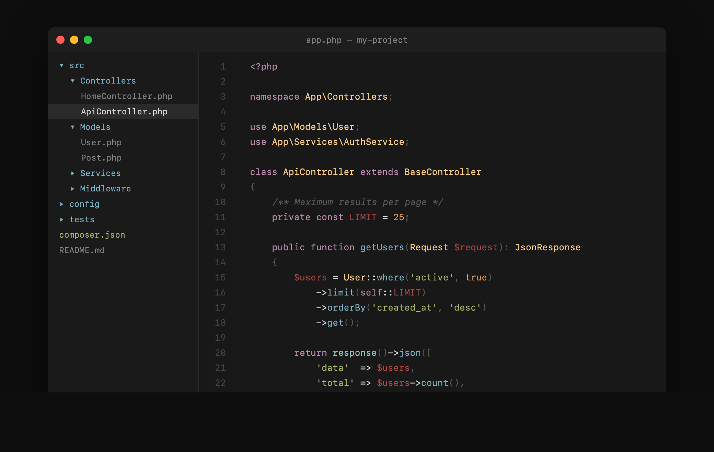

# Mercurial Color Scheme

A dark color scheme for Sublime Text based on Warp Terminal's default palette. Clean, balanced, and easy on the eyes for long coding sessions.

## Preview

## Installation

### Package Control (Recommended)

1. Open Command Palette (`Cmd+Shift+P` / `Ctrl+Shift+P`)
2. Select **Package Control: Install Package**
3. Search for **Mercurial Color Scheme**
4. Activate: **Preferences > Color Scheme > Mercurial**

### Manual

1. Download `Mercurial.sublime-color-scheme`
2. Place in `Packages/User/` (Preferences > Browse Packages)
3. Activate: **Preferences > Color Scheme > Mercurial**

## Colors

| Role | Color | Hex |
|------|-------|-----|
| Background |  | `#181818` |
| Foreground |  | `#d8d8d8` |
| Comments |  | `#585858` |
| Strings |  | `#a1b56c` |
| Keywords |  | `#ba8baf` |
| Functions |  | `#7cafc2` |
| Tags/Variables |  | `#ab4642` |
| Classes/Types |  | `#f7ca88` |
| Numbers |  | `#dc9656` |
| Library/Support |  | `#86c1b9` |

## Supported Languages

Full syntax coverage for PHP, JavaScript, TypeScript, HTML, CSS, JSON, YAML, Markdown, SQL, Python, and all languages using standard TextMate scopes.

## Credits

- **Palette**: Based on [Warp Terminal](https://warp.dev) default dark theme
- **Author**: [Renzo Johnson](https://renzojohnson.com)
- **License**: MIT
